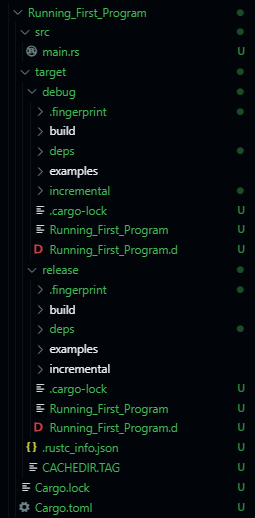

### 1. Compiling the file : when program is simple and contains only a single file.


**a. Enter ``` rustc file_name``` in the terminal.**

**b. It will create an executable file which can be executed,**

---

### 2. Complex Program using Multiple dependencies (Here Cargo is used)

Cargo is a Package Manager

**a. Create new rust Project using ``` cargo new Project_name ```**


Following Files and Folders will be created using this


1. Source folder will contain all the source files with ``.rs`` extension.
2. In src directory `main.rs` will be auto generated.
3. `Cargo.toml file` will conatin Information about Project regarding its `versions, edition, dependencies` it usings.

**b. To compile and run the code use `cargo run` int the terminal from root directory of project.**

1. It will compile and run the program in terminal.

Build


Execution


**b. To only Build the program use `cargo build` , it will only build the program will not execute it.**


**c. If you want to build only use `cargo build --release`**



**Note :-Optimization make code faster, While development phase `cargo build` is used, When handing over to the user `cargo build --release` is used.**